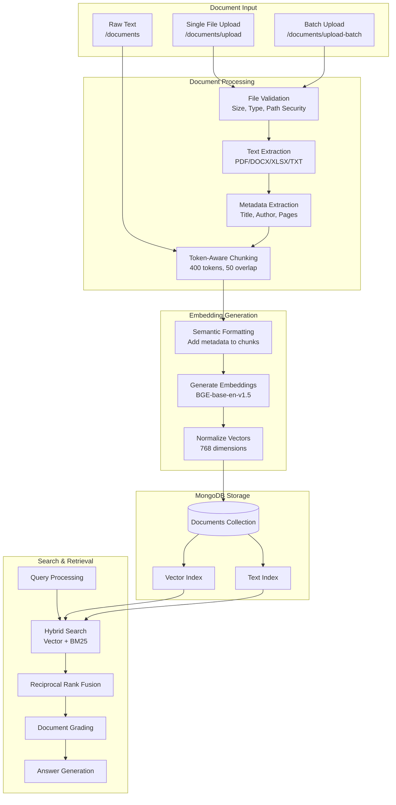
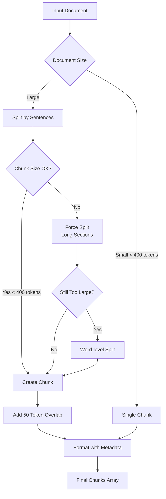

# Document Pipeline Technical Guide

A comprehensive technical reference for the LLM RAG Server document processing pipeline.

---

## Table of Contents

1. [Overview](#1-overview)
2. [Pipeline Flowchart](#2-pipeline-flowchart)
3. [Pipeline Flow Details](#3-pipeline-flow-details)
   - [3.1 File Upload & Validation](#31-file-upload--validation)
   - [3.2 Text Extraction](#32-text-extraction)
   - [3.3 Metadata Extraction](#33-metadata-extraction)
   - [3.4 Document Chunking](#34-document-chunking)
   - [3.5 Semantic Formatting](#35-semantic-formatting)
   - [3.6 Embedding Generation](#36-embedding-generation)
   - [3.7 MongoDB Storage](#37-mongodb-storage)
   - [3.8 Retrieval & Search](#38-retrieval--search)
4. [Class Reference](#4-class-reference)
   - [4.1 Document Processing Classes](#41-document-processing-classes)
   - [4.2 MongoDB Data Layer Classes](#42-mongodb-data-layer-classes)
   - [4.3 Embedding & Similarity Classes](#43-embedding--similarity-classes)
   - [4.4 Pipeline Architecture Classes](#44-pipeline-architecture-classes)
   - [4.5 API Route Classes](#45-api-route-classes)
5. [Python Package Dependencies](#5-python-package-dependencies)
   - [5.1 Document Processing Packages](#51-document-processing-packages)
   - [5.2 Embeddings & ML Packages](#52-embeddings--ml-packages)
   - [5.3 Database Packages](#53-database-packages)
   - [5.4 Web Framework Packages](#54-web-framework-packages)
   - [5.5 Utility Packages](#55-utility-packages)
6. [Data Models](#6-data-models)
7. [Configuration Reference](#7-configuration-reference)
8. [Storage Structure](#8-storage-structure)
9. [API Endpoints Reference](#9-api-endpoints-reference)
10. [Design Patterns](#10-design-patterns)

---

## 1. Overview

The Document Pipeline is a core component of the LLM RAG (Retrieval-Augmented Generation) Server. It handles the complete lifecycle of documents from upload through processing, chunking, embedding generation, storage, and semantic retrieval.

**Key Capabilities:**
- Multi-format document processing (PDF, DOCX, XLSX, TXT, MD, CSV, JSON)
- Token-aware intelligent chunking
- Local embedding generation using transformer models
- Hybrid search (Vector + BM25)
- LLM-powered answer generation with citations

**Architecture:**
- **Python Services**: FastAPI backend on port 8001
- **Database**: MongoDB on port 27017
- **Embedding Models**: Local SentenceTransformer models

---

## 2. Pipeline Flowchart

### High-Level Document Processing Flow



### Detailed RAG Pipeline Flow

```mermaid
flowchart LR
    subgraph Step1["Step 1: Query Understanding"]
        Q1[User Query] --> Q2[Query Expansion]
        Q2 --> Q3[Filter Extraction]
        Q3 --> Q4[Intent Detection]
    end

    subgraph Step2["Step 2: Hybrid Retrieval"]
        R1[Vector Search<br>Cosine Similarity]
        R2[BM25 Search<br>Full-text]
        R3[RRF Fusion<br>k=60]
    end

    subgraph Step3["Step 3: Document Grading"]
        G1[Relevance Scoring]
        G2[Recency Weighting]
        G3[Trust Scoring]
    end

    subgraph Step4["Step 4: Answer Generation"]
        A1[Context Window<br>Building]
        A2[LLM Synthesis]
        A3[Citation Extraction]
    end

    subgraph Step5["Step 5: Validation"]
        V1[Hallucination<br>Detection]
        V2[Completeness<br>Check]
    end

    subgraph Step6["Step 6: Learning"]
        L1[Record Interaction]
        L2[User Feedback]
    end

    Q4 --> R1
    Q4 --> R2
    R1 --> R3
    R2 --> R3
    R3 --> G1
    G1 --> G2
    G2 --> G3
    G3 --> A1
    A1 --> A2
    A2 --> A3
    A3 --> V1
    V1 --> V2
    V2 --> L1
    L1 --> L2
```



### Chunking Strategy Flow



---

## 3. Pipeline Flow Details

### 3.1 File Upload & Validation

**Entry Points:**
| Endpoint | Method | Purpose |
|----------|--------|---------|
| `/documents/upload` | POST | Single file upload |
| `/documents/upload-batch` | POST | Multiple files (max 4 concurrent) |
| `/documents` | POST | Raw text storage |

**Validation Steps:**
1. File received via multipart form data
2. Saved to temporary location
3. File type detected using `python-magic`
4. File size validated (max 100MB)
5. Path security validation (no directory traversal)

**Supported File Types:**
- PDF (`.pdf`)
- Word Documents (`.docx`)
- Excel Spreadsheets (`.xlsx`)
- Plain Text (`.txt`)
- Markdown (`.md`)
- CSV (`.csv`)
- JSON (`.json`)

### 3.2 Text Extraction

| File Type | Library | Extraction Method |
|-----------|---------|-------------------|
| PDF | PyMuPDF (fitz) | Text blocks, tables, images, annotations |
| DOCX | python-docx | Paragraphs, tables, headers/footers |
| XLSX | openpyxl | All sheets with sheet names as headers |
| TXT/MD | Built-in | Multi-encoding support (UTF-8, UTF-16, Latin-1, CP1252) |

### 3.3 Metadata Extraction

**Extracted Metadata:**
```python
DocumentMetadata:
    title: str           # Document title
    author: str          # Author name
    created_date: str    # Creation timestamp
    page_count: int      # Number of pages/sheets
    word_count: int      # Total word count
    has_tables: bool     # Contains tables
    has_images: bool     # Contains images
    table_count: int     # Number of tables
    sheet_names: list    # Excel sheet names
    language: str        # Detected language
    file_hash: str       # SHA256 hash for deduplication
```

### 3.4 Document Chunking

**Configuration:**
| Parameter | Default | Description |
|-----------|---------|-------------|
| `CHUNK_MAX_TOKENS` | 400 | Maximum tokens per chunk |
| `CHUNK_OVERLAP_TOKENS` | 50 | Overlap between chunks |
| `CHUNK_METADATA_OVERHEAD` | 50 | Reserved tokens for metadata |
| `CHARS_PER_TOKEN` | 4.0 | Average characters per token |

**Chunking Strategy:**
1. Calculate effective max characters: `(400 - 50) * 4.0 = 1400 chars`
2. Split document by sentences
3. Accumulate sentences until chunk is near max size
4. If a sentence exceeds max, force-split at word boundaries
5. Add 50-token overlap from previous chunk
6. Preserve context continuity across chunks

### 3.5 Semantic Formatting

Before embedding, metadata is prepended to improve retrieval accuracy:

```
Title: [document title]
Subject: [subject/category]
Keywords: [tag1, tag2, tag3]

[actual chunk content]
```

This improves retrieval accuracy by 5-10% by providing semantic context.

### 3.6 Embedding Generation

**Primary Model:** `BAAI/bge-base-en-v1.5`
- Dimensions: 768
- High-quality multilingual embeddings

**Fallback Model:** `sentence-transformers/all-MiniLM-L6-v2`
- Dimensions: 384
- Faster, smaller footprint

**Processing:**
- 8 worker threads for parallel processing
- Batch size: 32 documents
- Results normalized for cosine similarity

### 3.7 MongoDB Storage

**Collection:** `documents`

**Record Structure (one per chunk):**
```json
{
  "_id": "ObjectId",
  "id": "doc-uuid-chunk-0",
  "parent_id": "doc-uuid",
  "chunk_index": 0,
  "total_chunks": 5,
  "title": "Document Title",
  "content": "Chunk text content...",
  "department": "general",
  "type": "documentation",
  "subject": "category",
  "file_name": "original.pdf",
  "file_size": 250000,
  "upload_date": "ISODate",
  "tags": ["tag1", "tag2"],
  "metadata": {...},
  "vector": [0.123, 0.456, ...],
  "created_at": "ISODate",
  "updated_at": "ISODate"
}
```

**Indexes:**
- `parent_id` - Group chunks by document
- `department` - Filter by department
- `type` - Filter by document type
- `subject` - Filter by subject
- `upload_date` - Sort by date
- `tags` - Tag-based filtering
- Text index on `content` - BM25 search
- Vector index on `vector` - Semantic search

### 3.8 Retrieval & Search

**Hybrid Search Approach:**

1. **Vector Search**: Cosine similarity on embeddings
2. **BM25 Search**: MongoDB `$text` operator for full-text
3. **Reciprocal Rank Fusion (RRF)**: Combines rankings with k=60

**RRF Formula:**
```
score = Σ (1 / (k + rank_i))
```

**Deduplication:**
- Keep only highest-scoring chunk per document
- Return complete documents by combining chunks

---

## 4. Class Reference

### 4.1 Document Processing Classes

#### `DocumentProcessor` (document_processor.py)

Main orchestrator for document processing.

| Method | Parameters | Returns | Description |
|--------|------------|---------|-------------|
| `process_file()` | `file_path: str` | `ProcessedDocument` | Process file from disk |
| `process_bytes()` | `data: bytes, filename: str` | `ProcessedDocument` | Process file from memory |
| `detect_file_type()` | `file_path: str` | `str` | Detect MIME type |
| `compute_file_hash()` | `data: bytes` | `str` | SHA256 hash |
| `_process_pdf()` | `file_path: str` | `tuple[str, DocumentMetadata]` | Extract PDF content |
| `_process_docx()` | `file_path: str` | `tuple[str, DocumentMetadata]` | Extract DOCX content |
| `_process_xlsx()` | `file_path: str` | `tuple[str, DocumentMetadata]` | Extract XLSX content |
| `_process_text()` | `file_path: str` | `tuple[str, DocumentMetadata]` | Extract text content |
| `_validate_path()` | `file_path: str` | `bool` | Security validation |
| `_validate_file_size()` | `file_path: str` | `bool` | Size validation |

#### `DocumentMetadata` (document_processor.py)

Data class for document metadata.

| Field | Type | Description |
|-------|------|-------------|
| `title` | `str` | Document title |
| `author` | `str` | Author name |
| `created_date` | `str` | Creation timestamp |
| `page_count` | `int` | Number of pages |
| `word_count` | `int` | Total words |
| `has_tables` | `bool` | Contains tables |
| `has_images` | `bool` | Contains images |
| `table_count` | `int` | Number of tables |
| `sheet_names` | `List[str]` | Excel sheet names |
| `language` | `str` | Detected language |
| `file_hash` | `str` | SHA256 hash |

#### `ProcessedDocument` (document_processor.py)

Result dataclass for processed documents.

| Field | Type | Description |
|-------|------|-------------|
| `content` | `str` | Extracted text |
| `content_type` | `str` | MIME type |
| `metadata` | `DocumentMetadata` | Document metadata |
| `file_name` | `str` | Original filename |
| `file_size` | `int` | File size in bytes |
| `success` | `bool` | Processing success |
| `error` | `Optional[str]` | Error message if failed |

#### `ErrorExplainer` (document_processor.py)

User-friendly error explanation service.

| Method | Parameters | Returns | Description |
|--------|------------|---------|-------------|
| `get_explanation()` | `error: Exception` | `str` | Classify and explain error |
| `explain_error_with_llm()` | `error: Exception, context: str` | `str` | LLM-based explanation |

### 4.2 MongoDB Data Layer Classes

#### `MongoDBBase` (mongodb/base.py)

Core MongoDB infrastructure and connection management.

| Method | Parameters | Returns | Description |
|--------|------------|---------|-------------|
| `connect()` | - | `bool` | Establish connection |
| `disconnect()` | - | `None` | Close connection |
| `health_check()` | - | `dict` | Check MongoDB status |
| `ensure_indexes()` | - | `None` | Create required indexes |
| `check_vector_support()` | - | `bool` | Check native vector search |

| Property | Type | Description |
|----------|------|-------------|
| `client` | `AsyncIOMotorClient` | MongoDB async client |
| `db` | `AsyncIOMotorDatabase` | Database instance |
| `vector_search_enabled` | `bool` | Vector support status |

#### `DocumentsMixin` (mongodb/documents.py)

Mixin providing document operations.

| Method | Parameters | Returns | Description |
|--------|------------|---------|-------------|
| `store_document()` | `title, content, department, type, ...` | `StoreResponse` | Chunk, embed, and store |
| `search_documents()` | `query, limit, filters` | `List[dict]` | Vector search with deduplication |
| `get_document()` | `document_id` | `dict` | Get all chunks combined |
| `list_documents()` | `skip, limit, filters` | `List[dict]` | List unique documents |
| `update_document_metadata()` | `document_id, updates` | `bool` | Update metadata only |
| `delete_document()` | `document_id` | `bool` | Delete document and chunks |
| `get_document_stats()` | - | `StatsResponse` | Collection statistics |

#### Helper Functions (mongodb/helpers.py)

| Function | Parameters | Returns | Description |
|----------|------------|---------|-------------|
| `chunk_document()` | `text, max_tokens, overlap` | `List[str]` | Token-aware chunking |
| `format_embedding_text()` | `chunk, title, subject, tags` | `str` | Add metadata prefix |
| `compute_content_hash()` | `content` | `str` | SHA256 hash |
| `calculate_max_chunk_chars()` | `max_tokens, overhead` | `int` | Calculate character limit |

### 4.3 Embedding & Similarity Classes

#### `LocalEmbeddingService` (services/document_embedder.py)

Local embedding generation using SentenceTransformers.

| Method | Parameters | Returns | Description |
|--------|------------|---------|-------------|
| `embed()` | `text: str` | `List[float]` | Single text embedding |
| `embed_batch()` | `texts: List[str]` | `List[List[float]]` | Batch embeddings |
| `embed_with_normalize()` | `text: str` | `List[float]` | Normalized embedding |
| `health_check()` | - | `dict` | Model status |

| Property | Type | Description |
|----------|------|-------------|
| `model` | `SentenceTransformer` | Loaded model instance |
| `embedding_dim` | `int` | Output dimensions (768 or 384) |
| `model_name` | `str` | Model identifier |

#### `DocumentRerankerService` (services/document_reranker.py)

Cross-encoder based document reranking.

| Method | Parameters | Returns | Description |
|--------|------------|---------|-------------|
| `rerank()` | `query, documents, top_k` | `List[dict]` | Rerank by relevance |
| `rerank_with_metadata()` | `query, documents, top_k` | `List[dict]` | Rerank preserving metadata |
| `score_pair()` | `query, document` | `float` | Score single pair |

**Model:** `cross-encoder/ms-marco-MiniLM-L-6-v2`

#### `EmbeddingService` (embedding_service.py)

Flexible embedding service with multiple backends.

| Method | Parameters | Returns | Description |
|--------|------------|---------|-------------|
| `generate_embedding()` | `text: str` | `List[float]` | Generate single embedding |
| `generate_embeddings_batch()` | `texts: List[str]` | `List[List[float]]` | Batch generation |
| `set_mode()` | `mode: str` | `None` | Switch backend mode |

| Mode | Description |
|------|-------------|
| `local` | SentenceTransformer model |
| `remote_st` | Remote sentence-transformers API |
| `remote_llama` | Remote llama.cpp API |

### 4.4 Pipeline Architecture Classes

#### `DocumentRetrievalPipeline` (pipelines/document/document_pipeline.py)

Main 6-step RAG pipeline orchestrator.

| Method | Parameters | Returns | Description |
|--------|------------|---------|-------------|
| `execute()` | `query, filters, top_k` | `PipelineResponse` | Run full pipeline |
| `execute_step()` | `step_name, context` | `context` | Run single step |
| `get_pipeline_stats()` | - | `dict` | Performance metrics |

**Pipeline Steps:**
1. Query Understanding
2. Hybrid Retrieval
3. Document Grading
4. Answer Generation
5. Validation
6. Learning Feedback

#### `DocumentPipelineContext` (pipelines/document/context.py)

Pipeline state container passed between steps.

| Field Group | Fields | Description |
|-------------|--------|-------------|
| **Input** | `query`, `filters`, `top_k`, `context_history` | Initial request |
| **Step 1** | `expanded_query`, `query_type`, `extracted_filters` | Query understanding |
| **Step 2** | `retrieved_chunks`, `retrieval_scores`, `retrieval_methods` | Retrieval results |
| **Step 3** | `graded_chunks`, `relevance_scores`, `rejected_chunks` | Grading results |
| **Step 4** | `answer`, `citations`, `confidence`, `context_used` | Generation results |
| **Step 5** | `is_valid`, `validation_issues`, `hallucination_score` | Validation results |
| **Step 6** | `learning_record_id` | Feedback tracking |
| **Metadata** | `query_id`, `chunks_retrieved`, `chunks_used`, `processing_time_ms` | Metrics |

| Method | Returns | Description |
|--------|---------|-------------|
| `to_response()` | `dict` | Format for API response |
| `to_learning_record()` | `dict` | Format for learning storage |

#### Pipeline Step Classes (pipelines/document/steps/)

| Class | File | Responsibility |
|-------|------|----------------|
| `QueryUnderstandingStep` | `query_understanding.py` | Query expansion, filter extraction, intent detection |
| `HybridRetrievalStep` | `hybrid_retrieval.py` | Vector + BM25 search with RRF fusion |
| `DocumentGradingStep` | `document_grading.py` | LLM scoring, recency/trust weighting |
| `AnswerGenerationStep` | `answer_generation.py` | Context building, LLM synthesis, citations |
| `ValidationStep` | `validation.py` | Hallucination detection, completeness check |
| `LearningFeedbackStep` | `learning_feedback.py` | Interaction recording |

### 4.5 API Route Classes

#### Document Routes (routes/document_routes.py)

| Endpoint | Method | Handler | Description |
|----------|--------|---------|-------------|
| `/documents` | POST | `store_document()` | Store raw text |
| `/documents/upload` | POST | `upload_document()` | Upload file |
| `/documents/upload-batch` | POST | `upload_documents_batch()` | Batch upload |
| `/documents/search` | GET | `search_documents()` | Semantic search |
| `/documents/aggregate` | GET | `aggregate_documents()` | Count/list |
| `/documents/total-count` | GET | `get_total_document_count()` | Total count |
| `/documents/by-title` | GET | `get_document_by_title()` | Get by title |
| `/documents/by-title` | DELETE | `delete_document_by_title()` | Delete by title |
| `/documents/stats/summary` | GET | `get_document_stats()` | Statistics |
| `/documents/{id}` | GET | `get_document()` | Get by ID |
| `/documents/{id}` | PATCH | `update_document_metadata()` | Update metadata |
| `/documents/{id}` | DELETE | `delete_document()` | Delete by ID |

#### Pipeline Routes (api/document_pipeline_routes.py)

| Endpoint | Method | Description |
|----------|--------|-------------|
| `/api/documents/search` | POST | Direct vector search |
| `/api/documents/query` | POST | Full RAG with LLM |
| `/api/documents/query-stream` | POST | Streaming RAG response |
| `/api/documents/feedback` | POST | Record user feedback |

---

## 5. Python Package Dependencies

### 5.1 Document Processing Packages

| Package | Version | Purpose | Key Functions Used |
|---------|---------|---------|-------------------|
| `pymupdf` | ^1.23.0 | PDF processing | `fitz.open()`, `page.get_text()`, `page.get_tables()` |
| `python-docx` | ^1.1.0 | Word document parsing | `Document()`, `doc.paragraphs`, `doc.tables` |
| `openpyxl` | ^3.1.0 | Excel spreadsheet parsing | `load_workbook()`, `ws.iter_rows()` |
| `python-magic` | ^0.4.27 | File type detection | `magic.from_file()`, `magic.from_buffer()` |

### 5.2 Embeddings & ML Packages

| Package | Version | Purpose | Key Functions Used |
|---------|---------|---------|-------------------|
| `sentence-transformers` | ^2.2.0 | Embedding models | `SentenceTransformer()`, `model.encode()` |
| `numpy` | ^1.24.0 | Vector operations | `np.array()`, `np.linalg.norm()`, `np.dot()` |
| `torch` | ^2.0.0 | ML backend | GPU acceleration, tensor operations |
| `transformers` | ^4.35.0 | Model loading | Tokenizers, model configs |

### 5.3 Database Packages

| Package | Version | Purpose | Key Functions Used |
|---------|---------|---------|-------------------|
| `pymongo` | ^4.6.0 | MongoDB sync client | `MongoClient()`, CRUD operations |
| `motor` | ^3.3.0 | MongoDB async client | `AsyncIOMotorClient()`, async CRUD |
| `redis` | ^5.0.0 | Caching (optional) | `Redis()`, `get()`, `set()` |

### 5.4 Web Framework Packages

| Package | Version | Purpose | Key Functions Used |
|---------|---------|---------|-------------------|
| `fastapi` | ^0.104.0 | REST API framework | `FastAPI()`, `@router.get/post`, `UploadFile` |
| `uvicorn` | ^0.24.0 | ASGI server | `uvicorn.run()` |
| `httpx` | ^0.25.0 | Async HTTP client | `httpx.AsyncClient()`, `client.post()` |
| `aiohttp` | ^3.9.0 | Alternative async HTTP | `aiohttp.ClientSession()` |
| `aiofiles` | ^23.2.0 | Async file I/O | `aiofiles.open()` |
| `python-multipart` | ^0.0.6 | Form data parsing | File upload handling |

### 5.5 Utility Packages

| Package | Version | Purpose | Key Functions Used |
|---------|---------|---------|-------------------|
| `pydantic` | ^2.5.0 | Data validation | `BaseModel`, `Field`, validators |
| `python-dotenv` | ^1.0.0 | Environment config | `load_dotenv()`, `os.getenv()` |
| `rank-bm25` | ^0.2.2 | BM25 scoring (optional) | `BM25Okapi()`, `get_scores()` |
| `hashlib` | (stdlib) | Hashing | `hashlib.sha256()`, `hashlib.md5()` |
| `uuid` | (stdlib) | ID generation | `uuid.uuid4()` |
| `asyncio` | (stdlib) | Async programming | `gather()`, `create_task()`, semaphores |

---

## 6. Data Models

### Request Models

```python
class DocumentCreate(BaseModel):
    """Request model for creating documents"""
    title: str                          # Required document title
    content: str                        # Required document content
    department: str = "general"         # Department classification
    type: str = "documentation"         # Document type
    subject: Optional[str] = None       # Subject/category
    file_name: Optional[str] = None     # Original filename
    file_size: int = 0                  # File size in bytes
    tags: Optional[List[str]] = None    # Searchable tags
    metadata: Optional[Dict] = None     # Additional metadata

class DocumentUpdate(BaseModel):
    """Request model for updating documents"""
    title: Optional[str] = None
    department: Optional[str] = None
    type: Optional[str] = None
    subject: Optional[str] = None
    tags: Optional[List[str]] = None
    metadata: Optional[Dict] = None

class SearchRequest(BaseModel):
    """Request model for document search"""
    query: str                          # Search query
    limit: int = 10                     # Max results
    department: Optional[str] = None    # Filter by department
    type: Optional[str] = None          # Filter by type
    subject: Optional[str] = None       # Filter by subject
    tags: Optional[List[str]] = None    # Filter by tags
```

### Response Models

```python
class StoreResponse(BaseModel):
    """Response for document storage"""
    success: bool
    document_id: str
    chunks: int
    message: str

class SearchResult(BaseModel):
    """Individual search result"""
    id: str
    parent_id: str
    title: str
    content: str
    relevance_score: float
    chunk_index: int
    total_chunks: int
    department: str
    type: str

class StatsResponse(BaseModel):
    """Document statistics response"""
    total_documents: int
    total_chunks: int
    departments: Dict[str, int]
    types: Dict[str, int]
    subjects: Dict[str, int]
```

---

## 7. Configuration Reference

### Environment Variables

```bash
# MongoDB Configuration
MONGODB_URI=mongodb://localhost:27017/?directConnection=true
MONGODB_DATABASE=rag_server
VECTOR_SEARCH_ENABLED=true

# Chunking Configuration
CHUNK_MAX_TOKENS=400
CHUNK_OVERLAP_TOKENS=50
CHUNK_METADATA_OVERHEAD=50
CHARS_PER_TOKEN=4.0

# Embedding Configuration
EMBEDDING_MODEL=BAAI/bge-base-en-v1.5
EMBEDDING_DIMENSIONS=768
EMBEDDING_SERVICE_URL=       # Empty for local, URL for remote

# Server Configuration
HOST=0.0.0.0
PORT=8001
MAX_UPLOAD_SIZE=104857600    # 100MB

# Search Configuration
DEFAULT_SEARCH_LIMIT=10
SIMILARITY_THRESHOLD=0.4

# LLM Configuration (for pipeline steps)
LLM_GENERAL_URL=http://localhost:8081
LLM_SQL_URL=http://localhost:8080
```

### Default Values

| Setting | Value | Description |
|---------|-------|-------------|
| Max file size | 100 MB | Maximum upload size |
| Max concurrent uploads | 4 | Batch processing limit |
| Embedding threads | 8 | Worker pool size |
| Embedding batch size | 32 | Texts per batch |
| Embedding cache size | 5000 | MD5-keyed cache limit |
| RRF k parameter | 60 | Rank fusion smoothing |

---

## 8. Storage Structure

### MongoDB Document Schema

```json
{
  "_id": "ObjectId('...')",
  "id": "550e8400-e29b-41d4-a716-446655440000-chunk-0",
  "parent_id": "550e8400-e29b-41d4-a716-446655440000",
  "chunk_index": 0,
  "total_chunks": 5,
  "title": "API Specification Document",
  "content": "This document describes the REST API endpoints...",
  "department": "engineering",
  "type": "specification",
  "subject": "API Design",
  "file_name": "api-spec.pdf",
  "file_size": 250000,
  "upload_date": "2024-01-15T10:30:00Z",
  "tags": ["rest", "api", "v2"],
  "metadata": {
    "author": "John Smith",
    "created_date": "2024-01-10T00:00:00Z",
    "page_count": 45,
    "word_count": 12500,
    "has_tables": true,
    "has_images": false,
    "table_count": 8,
    "language": "en",
    "file_hash": "a1b2c3d4e5f6..."
  },
  "vector": [0.123, -0.456, 0.789, ...],
  "created_at": "2024-01-15T10:30:00Z",
  "updated_at": "2024-01-15T10:30:00Z"
}
```

### Index Configuration

```javascript
// Chunk grouping
db.documents.createIndex({ "parent_id": 1 })

// Filtering
db.documents.createIndex({ "department": 1 })
db.documents.createIndex({ "type": 1 })
db.documents.createIndex({ "subject": 1 })
db.documents.createIndex({ "upload_date": -1 })
db.documents.createIndex({ "tags": 1 })

// Full-text search (BM25)
db.documents.createIndex({ "content": "text", "title": "text" })

// Vector search (MongoDB 8.2+)
db.documents.createIndex({ "vector": "vector" }, {
  "vectorSearchOptions": {
    "dimensions": 768,
    "similarity": "cosine"
  }
})
```

---

## 9. API Endpoints Reference

### Document Management

#### Upload Single Document
```http
POST /documents/upload
Content-Type: multipart/form-data

file: <binary>
department: engineering
type: specification
subject: API Design
tags: rest,api,v2
```

**Response:**
```json
{
  "success": true,
  "message": "Document uploaded and processed successfully",
  "document_id": "550e8400-e29b-41d4-a716-446655440000",
  "chunks_created": 12,
  "text_extracted": 5000,
  "filename": "api-spec.pdf"
}
```

#### Batch Upload
```http
POST /documents/upload-batch
Content-Type: multipart/form-data

files: <binary[]>
department: engineering
```

**Response:**
```json
{
  "success": true,
  "total_files": 5,
  "successful": 5,
  "failed": 0,
  "results": [...]
}
```

#### Search Documents
```http
GET /documents/search?query=authentication&limit=5&department=engineering
```

**Response:**
```json
[
  {
    "id": "doc-uuid-chunk-2",
    "parent_id": "doc-uuid",
    "title": "API Specification",
    "content": "Authentication is handled via JWT tokens...",
    "relevance_score": 0.87,
    "chunk_index": 2,
    "total_chunks": 12,
    "department": "engineering",
    "type": "specification"
  }
]
```

### RAG Pipeline

#### Query with RAG
```http
POST /api/documents/query
Content-Type: application/json

{
  "query": "How does authentication work?",
  "top_k": 5,
  "filters": {
    "department": "engineering"
  }
}
```

**Response:**
```json
{
  "answer": "Authentication is implemented using JWT tokens...",
  "citations": [
    {
      "document_id": "...",
      "title": "API Specification",
      "chunk_index": 2,
      "relevance_score": 0.87
    }
  ],
  "confidence": 0.92,
  "processing_time_ms": 1250
}
```

---

## 10. Design Patterns

### Patterns Used

| Pattern | Implementation | Purpose |
|---------|----------------|---------|
| **Mixin** | `DocumentsMixin` | Reusable document methods for `MongoDBBase` |
| **Singleton** | Embedding/Reranker services | Thread-safe model instances |
| **Service Layer** | Routes → Services → Data | Separation of concerns |
| **Pipeline** | `DocumentRetrievalPipeline` | Step-by-step processing |
| **Context Object** | `DocumentPipelineContext` | State passing between steps |
| **Strategy** | Chunking methods | Swappable chunking algorithms |
| **Factory** | Error explanations | Create appropriate error messages |

### Concurrency Model

```
┌─────────────────────────────────────────────────────┐
│                  FastAPI (async)                     │
├─────────────────────────────────────────────────────┤
│  Request → Route Handler → Service → MongoDB        │
│               ↓                                      │
│     ThreadPoolExecutor (8 workers)                  │
│               ↓                                      │
│     SentenceTransformer.encode() (CPU/GPU)          │
└─────────────────────────────────────────────────────┘
```

### Error Handling Strategy

1. **Validation Errors**: Return 400 with descriptive message
2. **Processing Errors**: Log, explain with LLM, return user-friendly message
3. **Database Errors**: Retry with exponential backoff, then fail gracefully
4. **Embedding Errors**: Fallback to alternative model or skip embedding

### Graceful Degradation

- If vector search unavailable: Fall back to text search only
- If LLM unavailable: Return retrieved documents without synthesis
- If reranker fails: Skip reranking, use initial scores
- If single chunk fails: Continue with remaining chunks

---

## Appendix: Quick Reference

### Common Operations

```python
# Initialize pipeline
from pipelines.document import DocumentRetrievalPipeline
pipeline = DocumentRetrievalPipeline()

# Process single document
from document_processor import DocumentProcessor
processor = DocumentProcessor()
result = processor.process_file("/path/to/document.pdf")

# Generate embedding
from services.document_embedder import LocalEmbeddingService
embedder = LocalEmbeddingService()
vector = embedder.embed("text to embed")

# Search documents
from mongodb import MongoDBService
db = MongoDBService()
results = await db.search_documents("query", limit=10)
```

### Troubleshooting

| Issue | Cause | Solution |
|-------|-------|----------|
| Slow uploads | Large files | Increase timeout, use batch endpoint |
| Poor search results | Wrong embeddings | Check model loaded correctly |
| MongoDB timeout | Connection issues | Verify URI, check firewall |
| OOM errors | Large batches | Reduce batch size, add GPU memory |

---

*Document generated for LLM RAG Server - Document Pipeline v1.0*
